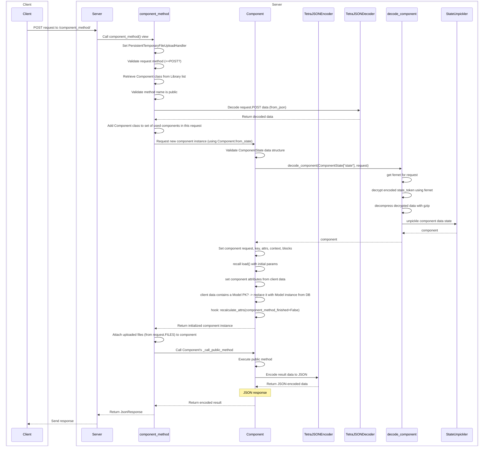

# Attribute data life cycle

The data attributes of a component exist within a specific lifecycle. The component, when constructed or resumed sets its atributes in a certain order (see below). In each step, the already existing attribute data are overridden.

## 1. Attribute assignment

```python
class Person(Component):
    name:str = "John Doe"
    age:int = None

    ...
```

When Attributes are set directly in the class, they are used as default values, as in any other python class too. Even if no `load()` method is present, the component can use this values.

## 2. Resumed data from encrypted state

If the component is resumed from a previous state, the encrypted state data is decrypted, and all component attributes are set from the previous state.
This is omitted if the component is initialized the first time, as there is no encrypted previous state yet.

## 3. The `load()` method

Next, the component's `load()` method is called. Any data assignment to the attributes overrides the previous values.

```python
class Person(Component):
    name:str = "John Doe"
    age:int = None

    def load(self, pk:int, *args, **kwargs):
        person = Person.objects.get(pk=pk)
        self.name = person.name
        self.age = person.age
```

Attributes that set in the `load()` method are **not** saved with the state, as the values are overwritten in the subsequent step. This seems to be extraneous, but in fact makes sure that the component attributes gets a consistent initialization.


## 4. The client data

The final step involves updating attributes using *data* passed from the client-side to the server via component methods. Note that this is not the same as the *state*:

 * The **state** represents the "frozen data" sent to the client during the last render, essentially what the client received initially. 
 * The **data** refers to dynamic values, such as a component input tag's value, which may have changed during the last interaction cycle.


# Events on the client side

Have a look at the [events][events.md].

# Sequence diagram

What happens when a public method is called? This sequence diagram shows everything.

