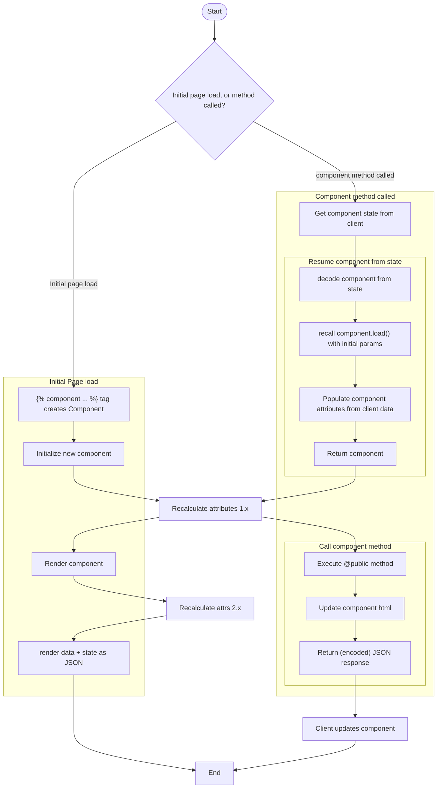

```mermaid
flowchart TD
 subgraph initial_page_load["Initial Page load"]
        as_tag["{% component ... %} tag creates Component"]
        create_component["Initialize new component"]
        component_render["Render component"]
        render_data["render data + state as JSON"]
  end


 subgraph s1["Component method called"]
        get_client_state["Get component state from client"] --> decode_component
        subgraph resume_component["Resume component from state"]
            recall_load["recall component.load() with initial params"]
            decode_component["decode component from state"]
            populate_data["Populate component attributes from client data"]
            return_component["Return component"]
        end
        subgraph call_component_method["Call component method"]
            call_public_method["Execute @public method"]
            update["Update component html"]
            json_response["Return (encoded) JSON response"]
        end
  end
    as_tag --> create_component
    decode_component --> recall_load
    recall_load --> populate_data
    populate_data --> return_component
    json_response --> client_updates_component["Client updates component"]
    call_public_method --> update
    return_component --> recalculate_attrs["Recalculate attributes 1.x"]
    recalculate_attrs --> call_public_method & component_render
    create_component --> recalculate_attrs
    recalculate_attrs2["Recalculate attrs 2.x"] --> render_data
    component_render --> recalculate_attrs2
    start(["Start"]) --> page_load_or_method_called{"Initial page load, or method called?"}
    page_load_or_method_called -- component method called --> get_client_state
    page_load_or_method_called -- Initial page load --> as_tag
    render_data --> _end(["End"])
    client_updates_component --> _end["End"]
    update --> json_response
```